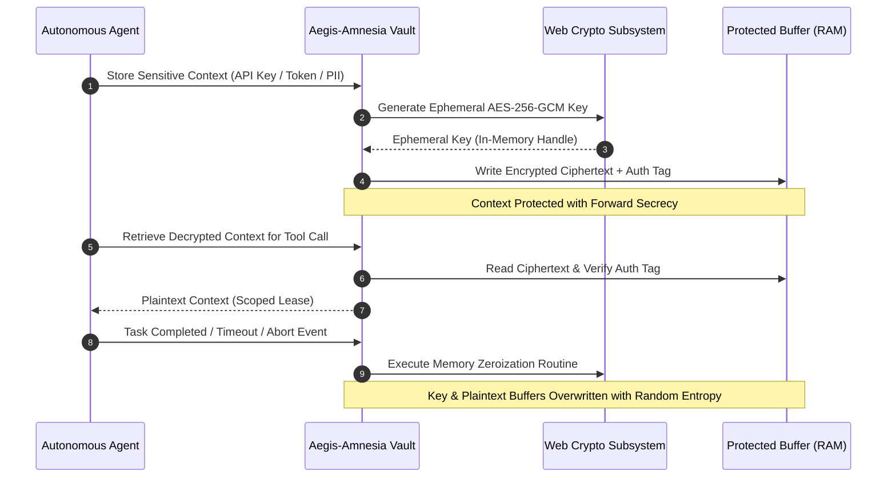

# Aegis-Amnesia: Cryptographic Ephemeral Memory Vault for AI Agents

> Secure, in-RAM cryptographic memory store featuring automated AES-256-GCM key zeroization, ephemeral execution contexts, and anti-retrieval memory guarantees for autonomous AI agents.

[](https://www.typescriptlang.org/)
[](https://vitest.dev/)
[](https://en.wikipedia.org/wiki/Galois/Counter_Mode)
[](LICENSE)

---

## Overview

Autonomous AI agents frequently handle sensitive user credentials, PII, and proprietary execution contexts during complex tool-use workflows. Traditional agent architectures store intermediate scratchpads in persistent disk caches or unencrypted application memory, exposing sensitive data to:
- **Memory Dump Exploitation**: Attackers extracting plaintext keys from un-zeroized heap buffers.
- **Context Injection**: Retained historical scratchpads polluting future multi-turn reasoning runs.
- **Unauthorized Context Retrieval**: Post-execution inspection of completed agent runs.

**Aegis-Amnesia** provides a cryptographically hardened memory vault. All sensitive contexts are encrypted in RAM using ephemeral AES-256-GCM keys. Upon task completion, timeout expiration, or error interruption, the vault performs explicit memory zeroization, overwriting key bytes with pseudorandom entropy to guarantee non-retrievability.

---

## Memory Security Lifecycle



---

## Core Capabilities

- **In-RAM AES-256-GCM Encryption**: All agent state fragments are encrypted before storage.
- **Deterministic Key Zeroization**: Utilizes low-level byte overwriting to prevent memory reconstruction after garbage collection.
- **Time-To-Live (TTL) Leases**: Context leases self-destruct automatically after a configurable idle window.
- **Interactive Security Dashboard (`dashboard/`)**: Real-time visualization of active memory allocations, lease expirations, and zeroization events.

---

## Repository Structure

```
.
├── src/                      # Core cryptographic vault and memory buffer logic
├── tests/                    # Vitest unit test suite validating encryption & zeroization
├── dashboard/                # Real-time memory allocation monitoring web UI
├── docs/                     # Cryptographic threat models and API references
├── examples/                 # Integration examples for LangChain and Node.js agents
├── package.json              # Node.js dependencies and test scripts
├── tsconfig.json             # Strict TypeScript compiler configuration
└── vitest.config.ts          # Vitest test runner configuration
```

---

## Getting Started

### Prerequisites
- Node.js 18+ (or Node.js 20+ LTS)
- npm / pnpm

### Installation & Testing
```bash
# Clone the repository
git clone https://github.com/HamzaKhanBUIC/aegis-amnesia.git
cd aegis-amnesia

# Install dependencies
npm install

# Run the complete cryptographic test suite
npm test
```

---

## Usage Example

```typescript
import { AmnesiaVault } from './src/vault';

// Initialize memory vault with a 60-second TTL
const vault = new AmnesiaVault({ defaultTtlMs: 60000 });

// Securely store sensitive context
const leaseId = await vault.store('OPENAI_API_KEY', 'sk-proj-sensitive-token-12345');

// Retrieve during authorized execution
const secret = await vault.retrieve(leaseId);
console.log('Active Secret:', secret);

// Explicitly zeroize memory upon task completion
await vault.purge(leaseId);
// Key and ciphertext buffers are immediately zeroized in RAM
```

---

## License

MIT License - see [LICENSE](LICENSE) for details.
```
